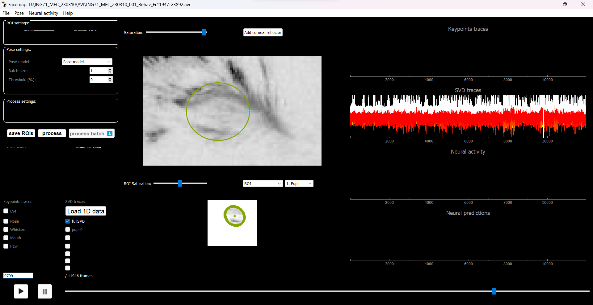
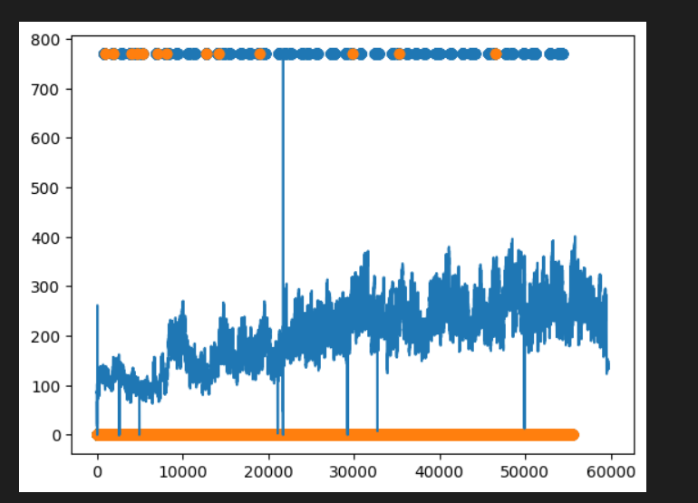
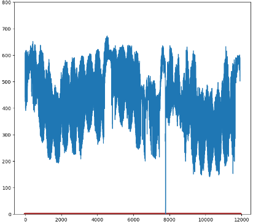
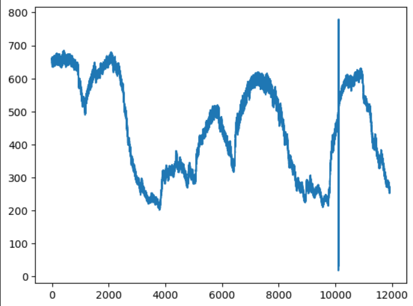
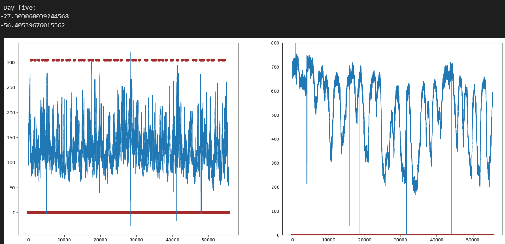

Rart om den klarer å plukke opp øyet her. Kanskje bruker den informasjon fra frames før og etter?

Tilsvarer øyeblikket ca når area går opp til maks

## Area data med samme ROI for alle videoer

Å bruke samme ROI/proc fil for prossesering av alle videofiler fører til at videofiler fra andre runs/dager får en dårlig prossesering.

*Video processed with ROI from a different day.*

Dette er run 009 fra 23.03.15 kjørt med sample proc filen som ble lagd for en annen dag(kanskje 23.03.09?). Store svingninger som ikke oppstår på videoen.

Når videoen blir prossesert med en manuel laget ROI blir den resulterende Area-dataen mye mer stabil og stemmer overens med bevegelsene vi ser i videoen.

*Video processed with manual ROI.*

